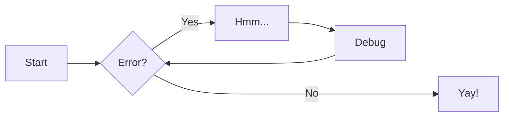
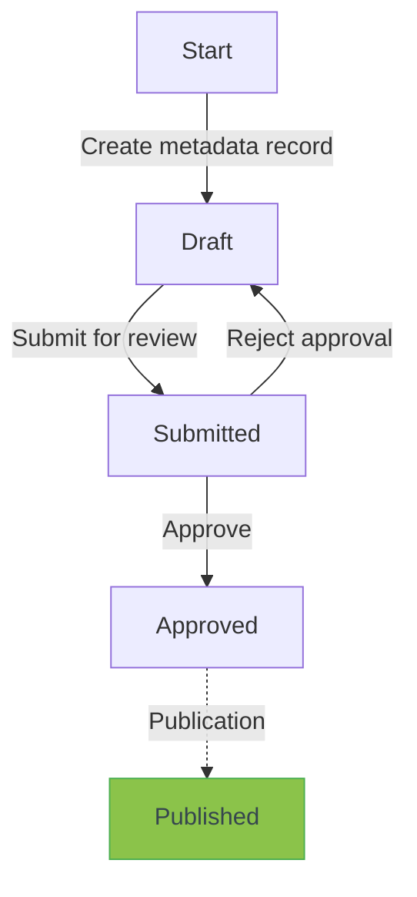
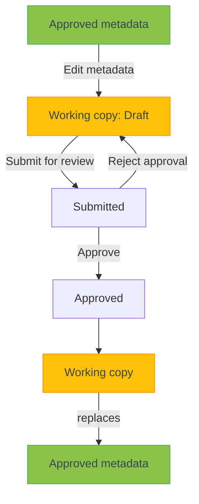
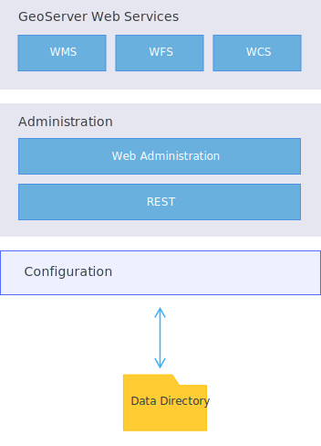
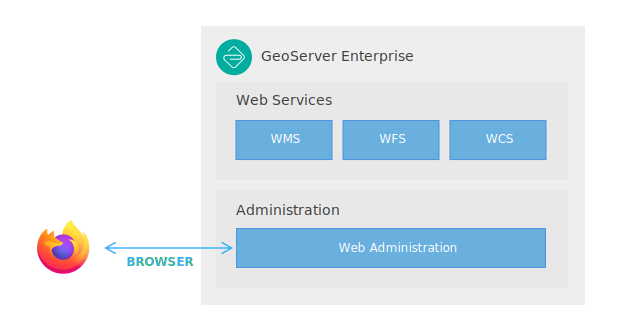

# GeoNetwork

Lorem ipsum dolor sit amet, consectetur adipiscing elit. Nulla et euismod nulla. Curabitur feugiat, tortor non consequat finibus, justo purus auctor massa, nec semper lorem quam in massa. Lorem ipsum dolor sit amet, consectetur adipiscing elit. Nulla et euismod nulla. Curabitur feugiat, tortor non consequat finibus, justo purus auctor massa, nec semper lorem quam in massa.

[Subscribe to our newsletter](#){ .md-button .md-button--primary }

Lorem ipsum dolor sit amet, consectetur adipiscing elit. Nulla et euismod nulla. Curabitur feugiat, tortor non consequat finibus, justo purus auctor massa, nec semper lorem quam in massa.

    graph LR
        A[Start] --> B{Error?};
        B -->|Yes| C[Hmm...];
        C --> D[Debug];
        D --> B;
        B ---->|No| E[Yay!];

## Metadata states

With the metadata workflow, the metadata goes through a set of states:

* **Draft**: the record is new or being edited.
* **Submitted**: the record has been submitted for approval to a Content Reviewer.
* **Approved**: the Content Reviewer has reviewed the metadata and approved it.

## Working copy

When an approved metadata is edited, a working copy is created from the approved metadata.

The metadata has 2 versions: `approved` and `working copy`

Changes are done to the working copy, that should go through the approval process.

Once approved, the content of the working copy replaces the approved version and the working copy is removed.

Images can be different for _light_ and _dark_ mode:

## SVG Testing ground

